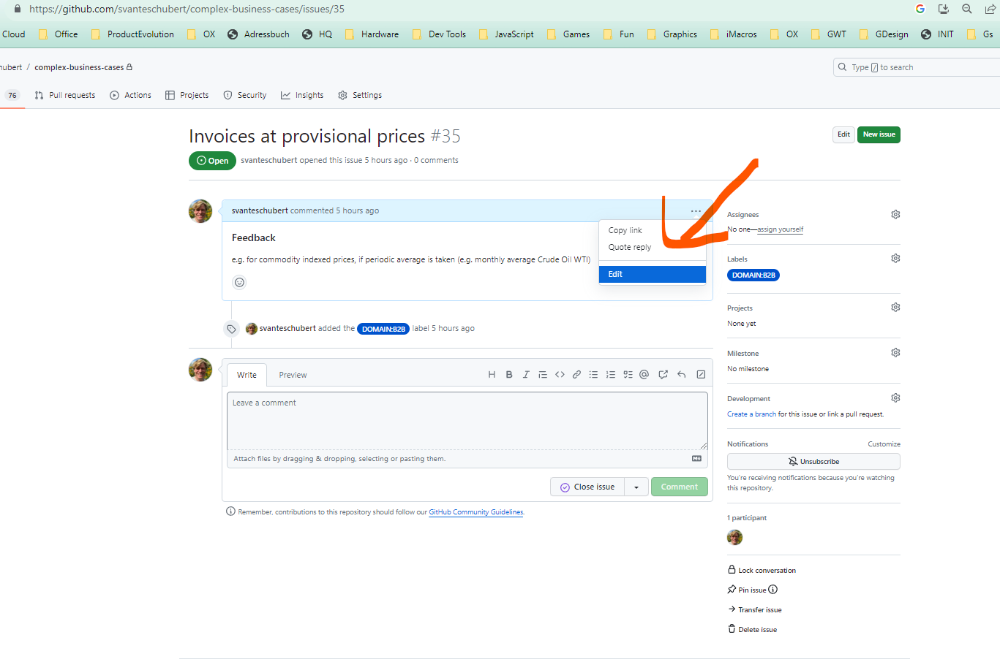

# complex-business-cases

## Introduction

[The complex business cases collected by French and German businesses](https://github.com/svanteschubert/complex-business-cases/issues). Meant as input for EN16931 maintained by CEN TC 434 and sponsored by EC.

The requirements were initally collected by KoSIT (Lars Rölker-Denker) and FeRD/AWV (Daniel Vinz) in a spreadsheet covering "complex business cases" for e-invoicing! Additional requirements were gathered in France by Cyrille Sautereau for the [German/French Factur-X extension](https://fnfe-mpe.org/factur-x/factur-x_en/).

The spreadsheet was imported as GitHub issues similar as done 3 years before for the EN16931 amendments for CEN TC 434 WG 1, to be able to discuss / collaborate more efficently.

[The import from spreadsheet to GitHub issues is open-source and is described in detail](./src/main/java/org/cen/tc434/issues/Csv2Github.md).

## Overview over the Issues

The spreadsheet consisted of three parts:

1. The GitHub Issues 1 to 34 are from the original German spreadsheet.
2. The GitHub Issues 35 to 39 are newly added by the industry (precisely by the Institute of digitalization of tax by Jan Koerner in charge).
3. The GitHub Issues 40 to 76 were shamelessly copied from Cyrilles' presentation.

The structure of the issue description is taken from the columns of the spreadsheet and still might be changed:

1. Background
2. Objective
3. Challenges
4. Open Questions
5. Approaches
6. Further Procedure
7. Feedback
but we have to start somewhere and we were a little under time pressure!

The issues have still draft status, as the data needs clean up and extension.
Daniel Vinz (FeRD/AWV) already found duplicates, like "duplicate invoice" and many issues (like those from the industry) are just the title.
Daniel and I are aiming to review the German part (1-34), which was translated by DeepML, on readability and clearness.
A professor used to say, if he has to read slower, the text is not well written! This should be our rule of guidance!

## Initial Timeline

As the first draft of input for CEN TC 434 should be ready at the start of next year, we aim for our first clean-up round within the next two weeks until the next 434 WG 5 (extension) call at 7th of November.
Our plan is to make this repository open for public review for businesses at this date.

## Editing & Cleaning up the Issues

Within the first two weeks, I would suggest that there are only 5 editors. Daniel, Lars, Cyrille, Jan and myself. Others, please get in contact with us or wait until the first clean up is done.

To add/change something just exchange the existing description:

The formation is done by text markdown, which is quite straight forward:
https://docs.github.com/de/get-started/writing-on-github/getting-started-with-writing-and-formatting-on-github/basic-writing-and-formatting-syntax

## Problem of Metadata (how to identify issues via labels)

Another interesting topic/task is to label/sort the issues by categories/labels/"different view angles" I have overtaken the labels from CEN TC 434 (also editorial states) and added some sectors today from a presentation by Edmund Grey: https://github.com/svanteschubert/complex-business-cases/label