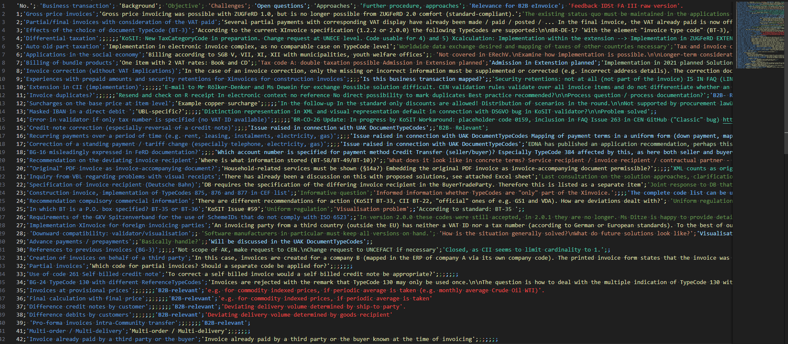

# Csv2GitHub

## Purpose

Initialisation of issue tracker from [the requirement spreadsheet (CSV)](../../../../../../test/resources/issues/20230719_Complex_Business_Cases_EN_withHeaderRow.csv). Creating [EN16931 issues](https://github.com/svanteschubert/complex-business-cases/issues) including our specific [labels](https://github.com/svanteschubert/complex-business-cases/labels) - only milestones were this time not imported.

**NOTE**: *Whenever a label/milestone is chosen, all related issues are being listed. [More advanced search](https://help.github.com/en/github/searching-for-information-on-github/searching-issues-and-pull-requests#search-by-label) is possible.*

## Prerequisition

* Java 11 should work
(was using JDK 17 LTS only as JDK 21 LTS is not currently supported by Gradle)
* Saving the amendment list spreadsheet to a [comma separated value text file](https://github.com/svanteschubert/complex-business-cases/blob/master/src/test/resources/issues/EN%2016931%20amendment%20topics%20list.csv)
* (New) private GitHub repository - where the new issues are being created into:
    Adjust the [REPO_NAME](https://github.com/svanteschubert/complex-business-cases/blob/main/src/main/java/org/cen/tc434/issues/Github.java#L33) variable using your repository.
* GitHub API access is provided by your GitHub "personal access" token in a "~/.github" file, for instance:

```javascript
login=your-github-loginname
oauth=your-personal-access-token-01234567890abcdefgh
```

**NOTE**: 

* You should create yourself a new "personal access token" with sufficent access rights under:*
* see https://github.com/settings/apps *
* Login GitHub -> upper right corner -> Settings -> Developer Settings -> "personal access token"
* **WARNING**: This time the oauth did not work for me and I used my personal token starting with "ghp_" under Linux (not Windows as before).

## How to trigger the generation

Call from a commandline in the root directory of the repository: "gradlew build run"

## How it works

1. The build system Gradle is executing the [main class "Csv2Github.java"](https://github.com/svanteschubert/complex-business-cases/blob/master/src/main/java/org/cen/tc434/issues/Csv2Github.java).
2. The CSV is being parsed line by line by the ["Csv.java" class](https://github.com/svanteschubert/complex-business-cases/blob/master/src/main/java/org/cen/tc434/issues/Csv.java).
3. GitHub is accssed via the ["Github.java" class](https://github.com/svanteschubert/complex-business-cases/blob/master/src/main/java/org/cen/tc434/issues/Github.java) taking advantage of the [Java GitHub API of Kohsuke Kawaguchi](https://github-api.kohsuke.org/).

## Afterthoughts / Post Mortem / Best Practise

I transformed the spreadsheet via [LibreOffice](https://www.libreoffice.org/) to CSV, as the export provides more functionality than Excel.

Unfortuantely, the given spreadsheet contained all CSV delimiters like ; ' and/or LineBreaks, which I had to mask those original characters.

Threrefore, before the export:

1. I added a new column only containing cells with '###' to mark the end of a line, as it is usually a line break in CSV created by LibreOffice and Excel.
2. I exchanged all ' with äää
3. I exchanged all ; with üüü
4. The CVS created by LibreOffice contained many LineBreaks in the cells. I used UltraEdit to exchange the line breaks ^p after export with ööö.
5. And exchanged the last cell containing ### with a linebreak (again using UltraEdit).

I translated the German part of the CSV with https://www.deepl.com/translator.

During the translation of the text file in deepml strangely some characters went missing by AI. Some ; and ö were missing after translated. Therefore, I had to manually adopt this.
The missing ; could easily be added by using the RainBow CSV extension within Visual Studio Code:
.
I had to add so many ; until a red one appeared - as this one was the last one!
Missing ; resulted earlier in Java exception when reading the CSV.

The encoded characters were translated back to the originals after the CSV content had been loaded.

Likely next time, I would iterate the spreadsheet (saved as ODT) directly with [ODFDOM](https://odftoolkit.org/odfdom/index.html) even allowing bi-directional work (in theory) and I would translate cell by cell using the DeepML API avoiding the CSV delimiter noise.
